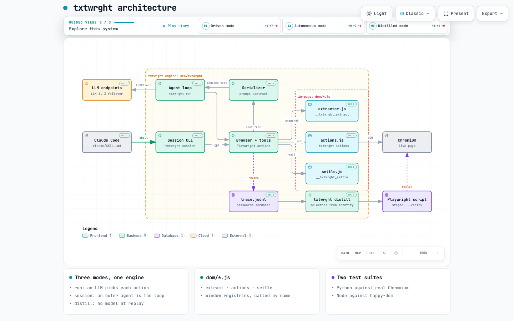
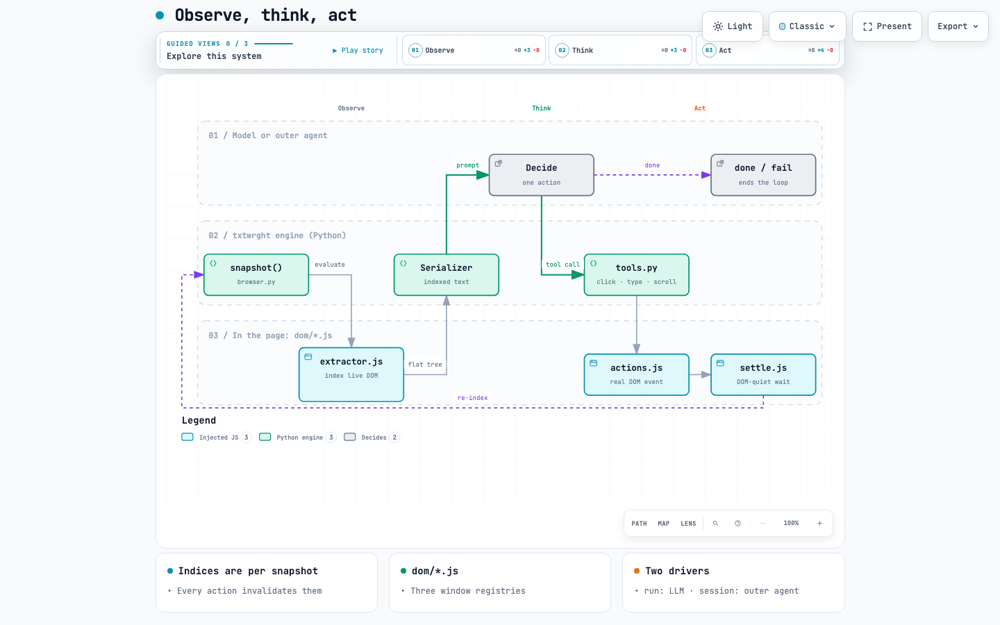
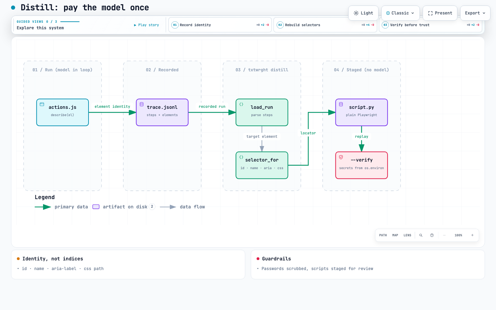

# txtwrght Architecture

One engine, thin bindings. This page is the source of truth for the split; the
build plan lives in `DEVELOPMENT_PLAN.md`.

## The split

```
txtwrght/                   <- one git repo, github.com/SingularityAI-Dev/txtwrght
├── src/txtwrght/           <- THE ENGINE. Python package `txtwrght`.
│   └── dom/                <- injected JavaScript (extractor, actions, settle)
│                              plus the Python serializer and loader
├── claude/                 <- Claude Code binding. Thin glue only.
└── tests/                  <- Python suite (Chromium) and tests/js (happy-dom)
```

<p align="center">
  <a href="docs/architecture/txtwrght.architecture.html">
    <picture>
      <source media="(prefers-color-scheme: dark)" srcset="docs/architecture/architecture-dark.png"/>
      
    </picture>
  </a>
</p>

<sub>Interactive version: [`txtwrght.architecture.html`](docs/architecture/txtwrght.architecture.html), generated with archify from [`txtwrght.architecture.json`](docs/architecture/txtwrght.architecture.json).</sub>

Reference clones (page-agent, space-agent) live outside the repo in
`~/development/txtwrght-refs/`.

`txtwrght` owns everything with logic in it: Playwright lifecycle, DOM extraction
(injected JavaScript ported from page-agent/browser-use, MIT), serialization to
indexed text, the action tools, the agent loop, tracing, and the session CLI.
Runtime-agnostic: any OpenAI-compatible endpoint drives Mode 1.

Bindings contain no engine logic. `claude/` teaches Claude Code to drive the
engine's per-step session CLI (a `SKILL.md`). If a change to a binding starts growing logic,
push it down into `txtwrght`'s `src/txtwrght/`.

## The two modes

1. **Autonomous**: `txtwrght run "task" --url ...`: the engine's internal loop
   calls an LLM over an OpenAI-compatible API, one action per step, max 40 steps.
2. **Driven**: `txtwrght session start/snapshot/act/end`: an outer agent (Claude
   Code, Hermes) is the loop. No second LLM; the driving agent keeps
   its own judgment, memory, and tools.

Both modes run the same loop; only who decides changes:

<p align="center">
  <a href="docs/architecture/observe-act-loop.html">
    <picture>
      <source media="(prefers-color-scheme: dark)" srcset="docs/architecture/loop-dark.png"/>
      
    </picture>
  </a>
</p>

<sub>Interactive version: [`observe-act-loop.html`](docs/architecture/observe-act-loop.html), generated with archify from [`observe-act-loop.workflow.json`](docs/architecture/observe-act-loop.workflow.json).</sub>

3. **Distilled**: `txtwrght distill <trace.jsonl>`: a run that worked becomes a
   plain Playwright script with no model in it at all. This is the composition
   that makes the workspace more than a browser-use clone: pay a model once to
   discover a flow, replay it for free afterwards. Selectors are rebuilt from
   the element identity the trace recorded at action time, since indices mean
   nothing after the run that produced them.

<p align="center">
  <a href="docs/architecture/distill.html">
    <picture>
      <source media="(prefers-color-scheme: dark)" srcset="docs/architecture/distill-dark.png"/>
      
    </picture>
  </a>
</p>

<sub>Interactive version: [`distill.html`](docs/architecture/distill.html), generated with archify from [`distill.dataflow.json`](docs/architecture/distill.dataflow.json).</sub>

## The contract worth protecting

The serialized page text is the prompt contract: `[n]` indexed elements, `*[n]`
for new-since-last-snapshot, tab-depth nesting, whitelisted attributes capped at
20 chars, plain text lines for visible non-interactive content. Golden tests in
`txtwrght/tests/test_serializer.py` pin it; changing that format is a breaking
change and must be deliberate.

Indices are only valid for the current snapshot. Every action invalidates them;
snapshot again before acting again.

## Versioning rules

`txtwrght` (repo name on GitHub: `txtwrght`) is the one git repository for the
engine and the `claude/` binding. The reference clones in `txtwrght-refs/`
carry upstream remotes; never commit into them.
