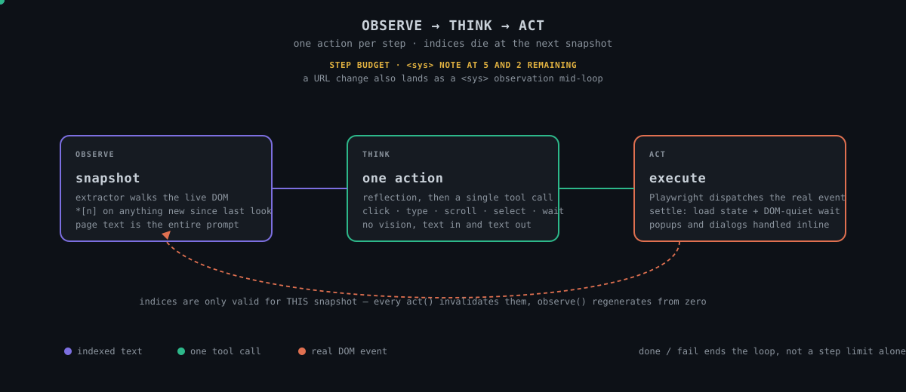

# hermd

**A headless, text-only browser agent, and a way to stop paying a model for the same click twice.**

Playwright drives a real Chromium, a DOM extractor serializes the live page to indexed text, and either a model or an outer agent picks one action per step. No screenshots. No vision model. And once a flow is proven, `hermd distill` turns the recorded run into a plain Playwright script with no model in it at all: pay once, replay for free.

[](CHANGELOG.md)
[](smoke/RESULTS.md)
[](LICENSE)
[](pyproject.toml)

One repo: the engine (`src/hermd`) plus both runtime bindings (`clau-dom/`, `gem-dom/`), folded together on 2026-08-23 because three repos for two `SKILL.md`/`GEMINI.md` files was ceremony the content never earned. See [`../ARCHITECTURE.md`](../ARCHITECTURE.md) for the split and [`../DEVELOPMENT_PLAN.md`](../DEVELOPMENT_PLAN.md) for how it got built.

<p align="center">
  
</p>

---

## The problem

Browser agents that reason over screenshots pay for pixels they don't need. A login form is nine interactive elements and a button; a vision model has to re-derive that from an image on every single step, at image-token prices, before it can even start reasoning about the task.

Browser agents that reason over raw HTML pay a different tax: a real page is thousands of nodes deep, most of it invisible, non-interactive, or noise. Sending it all to an LLM burns context on `<div>` soup the model will never act on.

And almost every agentic browser run repeats work it already solved. The same login flow, the same "click accept on the cookie banner," the same three-step checkout, driven by a model from scratch every time, at full agent-loop cost, because nothing captured what happened well enough to replay it without a model in the loop.

**hermd's answer to all three:** extract only what's interactive and visible, serialize it to a flat indexed text view a model can read cheaply and act on precisely, and record every run well enough that a proven one never needs a model again.

---

## What it is

A real browser (Playwright/Chromium), a DOM extractor that walks the live page and assigns a stable `[n]` index to every interactive element, and a serializer that turns that into one line of text per element. That indexed text *is* the entire prompt: no pixels, no DOM dump, no framework noise.

```
[Start of page]
Registration
*[0]<label for=username>Username />
*[1]<input type=text name=username placeholder=Your username />
*[2]<label for=password>Password />
*[3]<input type=password placeholder=Your password />
*[5]<select name=country>Choose one
South Africa
United Kingdom />
*[9]<button type=submit id=submit-btn>Register />
```

`*[n]` marks anything new since the last snapshot. Indices are only valid for the snapshot that produced them; every action invalidates them, and the next snapshot regenerates from zero. Whatever is driving the loop, a model or an outer agent, reads this and picks exactly one action: `click(9)`, `input_text(1, "geez")`, `select_dropdown_option(5, "South Africa")`.

---

## The loop

<p align="center">
  
</p>

**Observe.** The extractor re-walks the live DOM and reindexes.
**Think.** One reflection, one tool call. `click`, `input_text`, `select_dropdown_option`, `scroll`, `scroll_horizontally`, `wait`, `ask_user`, `done`.
**Act.** Playwright dispatches the real event, settles (load state plus a DOM-quiet wait), adopts popups and new tabs, dismisses dialogs per policy.

A step budget warning lands as a `<sys>` note at 5 and 2 steps remaining. A URL change lands as its own `<sys>` note mid-loop. The run ends on `done`, `fail`, or the step ceiling, whichever comes first, not the step ceiling alone.

---

## Three ways to spend a model's attention

**Autonomous.** The engine's own loop calls an LLM over any OpenAI-compatible endpoint.

```bash
hermd run "log in with username tomsmith and password SuperSecretPassword!" \
  --url https://the-internet.herokuapp.com/login
```

**Driven.** An outer agent — Claude Code, Gemini CLI, anything with a shell — is the loop. No second model. The browser stays alive between commands over a debugging port.

```bash
hermd session start --url https://example.com
hermd session snapshot
hermd session act click 5
hermd session end
```

`clau-dom/` ships the `SKILL.md` for this with Claude Code; `gem-dom/` ships the `GEMINI.md` equivalent. Both are thin glue over the same session CLI, on purpose: any logic they need belongs in the engine, not the binding.

**Distilled.** Once a flow is proven, freeze it. No model, no agent loop, no retry logic at replay time, just a script.

```bash
hermd distill traces/run-<id>.jsonl --verify
```

<p align="center">
  
</p>

Selectors are rebuilt from element identity recorded *at action time* (id, name, aria-label, css path), never from the step-local indices, because indices die the moment the run that produced them ends. Passwords are scrubbed at trace time and come back as `os.environ` lookups in the generated script, never literals. Scripts stage for review and are never auto-registered; `--verify` replays before you trust it.

---

## What it does not do

**Cross-origin iframes are out of scope.** The extractor descends into same-origin `contentDocument` (tested, works) but doesn't bridge cross-origin frame boundaries, which browsers block by design without a cooperating protocol on both sides. A task needing to act inside a cross-origin frame won't see into it.

**No vision, ever, by design.** If a task genuinely needs to read pixels — a canvas chart with no accessible data, a CAPTCHA — hermd isn't the tool. It trades that capability for cheap, precise, auditable text-only reasoning on the far larger set of tasks that don't need it.

---

## How this differs from browser-use

[browser-use](https://github.com/browser-use/browser-use) popularized the pattern hermd builds on: index interactive elements, serialize to text, one action per LLM step. hermd owes it and [page-agent](https://github.com/alibaba/page-agent) (which ported and extended the pattern) direct credit; the extractor and serializer here are a Playwright-native port, not a from-scratch reinvention. Full attribution chain below.

The difference is what happens *after* a run succeeds. browser-use's unit of value is the agent step; hermd's is the distilled script. A login flow driven by browser-use costs an LLM call every single time it runs. The same flow through `hermd distill` costs an LLM call exactly once, and every replay after that is a Playwright script with a `--verify` gate and zero token spend. hermd is also runtime-agnostic in a specific sense browser-use isn't: the same engine serves an autonomous LLM loop, a driven outer-agent loop (Claude Code, Gemini CLI), and a distilled zero-model script from one shared extractor and tool set, rather than one agent-loop product.

---

## Install

```bash
cd her-dom
python -m venv .venv && source .venv/bin/activate
pip install -e ".[dev]"
playwright install chromium
cp .env.example .env   # fill in an LLM endpoint (see below)
```

`.env` takes an ordered failover chain of OpenAI-compatible endpoints (`LLM_1_*`, `LLM_2_*`, `LLM_3_*`). No cloud API key is required if you're routing through a local proxy that already holds a subscription session; that's exactly how the Phase 1 exit gate below was run.

---

## Status

All build phases closed. The Phase 1 exit gate, a 10-task live smoke suite with recorded traces and a pass rate rather than a demo anecdote, passed **10 of 10** on 2026-08-17 (bar was 8 of 10, 181,851 tokens, 173 seconds). 92 tests green. Full detail in [`STATUS.md`](STATUS.md), full history in [`CHANGELOG.md`](CHANGELOG.md).

| | |
|---|---|
| Engine core | Extractor, serializer, tools, agent loop, tracing — done |
| Hardening | Popups, dialogs, settle, same-origin iframes, structured logs — done |
| `clau-dom` binding | Claude Code drives the session CLI, proven on a real login — done |
| `gem-dom` binding | Gemini CLI equivalent, same shape — done |
| Distillation | Trace → script, replay-verified, two live proofs (a login, a redirect chain) — done |
| Second-model gate | Same smoke suite on a non-Claude model, to isolate contract from prompt — deferred, no credential wired up yet |

---

## Third-party attribution

The DOM extractor (`src/hermd/dom/extractor.js`) and serializer (`src/hermd/dom/serializer.py`) are ported from [page-agent](https://github.com/alibaba/page-agent) (MIT), itself derived from [browser-use](https://github.com/browser-use/browser-use) (MIT, Copyright (c) 2024 Gregor Zunic). Full notice chain in [`LICENSE`](LICENSE).

---

## Tests

```bash
pytest                       # 92 tests: extractor, serializer, tools, distill
python smoke/run_smoke.py    # the live 10-task exit gate, needs a working LLM endpoint
```

Extractor and serializer behavior is pinned by golden tests over local fixtures; the serialized-page format is the prompt contract, and changing it is a breaking change that has to be deliberate.
